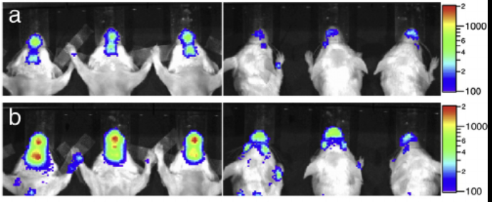

# UCLA-Brain-Metastasis
This repo contains a collection of R scripts I wrote during my time working in the Slamon Lab at UCLA to analyze raw output from an IVIS Bioluminescence imager. First, mice were injected with cancer cell lines via intracardiac injection and bioluminescence (flux), weight and survival were recorded during each week of the study. Below is an example of what these images look like...

Figure adapted from:
Thorsen, F. et al. Multimodal imaging enables early detection and characterization of changes in tumor permeability of brain metastases. *J. Control. Release* 172, 812-822 (2013). DOI:10.1016/j.jconrel.2013.10.019

